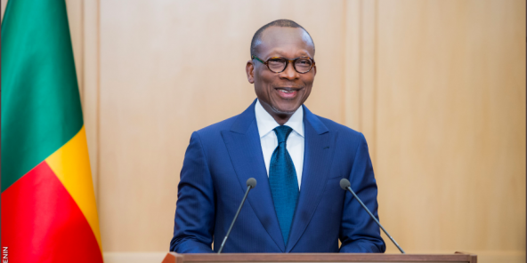

<html lang="fr">
    <head>
        <meta charset="utf-8">
        <title>Bonne fete de l'independance</title>
        <link rel="stylesheet" href="indépendance.css">
    </head>
    <body>
        
 
 6 

        

           
            <ul>
                <li></li>
                <li></li>
            </ul>
            
Copyright©-Tous droits reservés

         

        

         
 
 1

ans

             
<em>Happy inepenance day</em>

         
 
Le Bénin a accédé à l'indépendance complète le 1er août 1960, sous la dénomination de république du Dahomey. Les pouvoirs furent transmis au président Hubert Maga par le ministre d'État français Louis Jacquinot

         
         
 En 1972, l'officier Mathieu Kérékou prend le pouvoir,en 1975,il rebaptise le pays république populaire du Bénin. À la fin des années 1980, le Bénin entame un processus de transition démocratique et, en 1990, adopte une nouvelle constitution. La transition démocratique est assurée par Nicéphore Dieudonné Soglo, ancien Directeur Afrique de la Banque Mondiale. Le nom de Bénin est conservé, le pays devenant simplement la république du Bénin. Mathieu Kérékou, battu aux élections par Nicéphore D. Soglo, abandonne le pouvoir. Il y revient démocratiquement par les urnes en 1996 et ne rétablit pas la dictature. Il gouverne le pays jusqu'en 2006.La capitale officielle est Porto-Novo, Cotonou étant la capitale économique.Le Bénin a comme langue officielle le français et comme monnaie le franc CFA.Le président de la République entrant est Patrice Talon, qui a succédé à Boni Yayi lors des élections du 20 mars 2016. La passation de pouvoir entre le président sortant Boni Yayi et son successeur, l'homme d'affaires Patrice Talon s'est tenue le 6 avril 2016 au palais de la Marina à Cotonou.

         

         

    </body>
</html>
